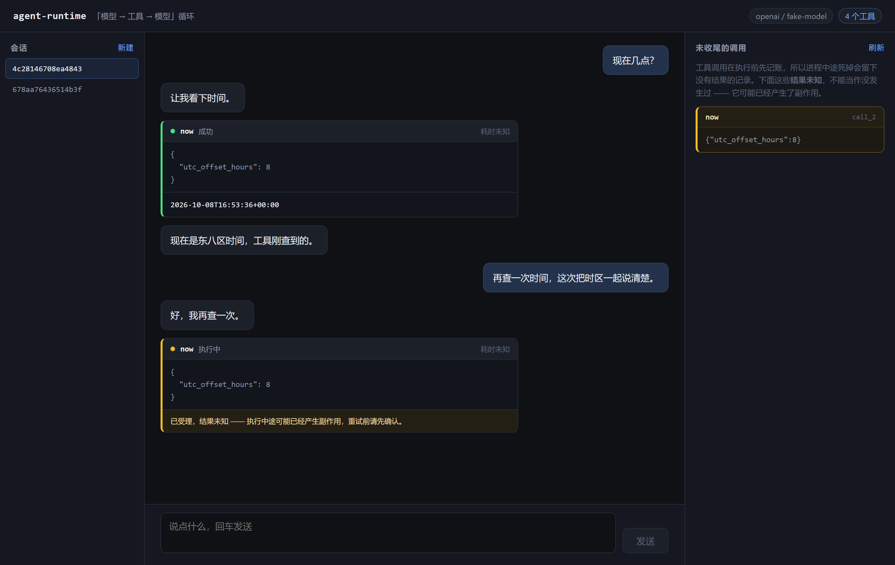

# agent-runtime

[](https://github.com/foolgone/agent-runtime/actions/workflows/ci.yml)

可恢复、幂等的 Agent 任务运行时。

模型 API 只提供「无状态的一次请求」。真实 Agent 需要的是：多轮工具调用、进程崩了能接着跑、
同一个请求重试不会产生两份副作用。这些都得自己搭，这个仓库就是在搭它们。



界面上那张一直停在「执行中」的工具卡片，就是下面「先记账，后执行」的可见结果：
调用已写进日志、结果未知，界面如实说出是哪一次调用，而不是笼统地报一句「出错了」。

```
用户输入 ──▶ 事件日志（append-only）
                 │
                 ├─▶ 重放 ──▶ 消息列表 ──▶ 模型 ──▶ 工具调用 ──▶ 写回日志
                 │                                        │
                 └────────────────────────────────────────┘
```

## 核心设计

**会话状态 = 事件日志的重放结果。** 没有可写状态表。每一次状态变化都是一条追加的事件，
当前状态永远由事件流推出来。好处是崩溃恢复不需要任何额外机制——进程没了日志还在，
重放一遍就回到崩溃前的位置。

**先记账，后执行。** 工具调用在真正执行之前就先写 `tool/call`。崩在工具执行中途时，
日志里会留下一条没有结果的调用记录，恢复时能认出「已受理、结果未知」，
而不是当它没发生过。

**权限边界在装配期定死。** 工具注册表可以被「收窄」成一个只含允许项的新注册表，
之后的取用、schema 生成、执行全都只看收窄后的集合。运行期不再临时判断权限——
运行期判断意味着每个调用点都要记得判断，忘一处就是漏洞。

## 快速开始

```bash
python -m venv .venv
.venv/Scripts/activate        # Linux/macOS: source .venv/bin/activate
pip install -e ".[dev]"

cp .env.example .env          # 填 AGENT_MODEL 和 AGENT_API_KEY
agent-runtime-chat
```

对话里模型可以直接调工具，调用过程打在终端上：

```
> 现在几点？

  → now({"utc_offset_hours": 8})
  ✓ now [1ms] 2026-10-08T14:32:10+08:00
现在是 2026-10-08 14:32（东八区）。
```

起 HTTP 服务：

```bash
agent-runtime-serve --port 8000
```

```bash
SESSION=$(curl -s -X POST localhost:8000/sessions | python -c "import sys,json;print(json.load(sys.stdin)['session_id'])")

curl -N -X POST localhost:8000/sessions/$SESSION/messages \
  -H 'content-type: application/json' \
  -d '{"input":"现在几点？"}'
```

```
event: text
data: {"text":"现在是"}

event: tool_started
data: {"call_id":"call_1","name":"now","arguments":"{\"utc_offset_hours\": 8}"}

event: tool_finished
data: {"call_id":"call_1","name":"now","is_error":false,"duration_ms":1,"content":"..."}

event: done
data: {"text":"...","rounds":2,"tool_calls":1,"stop_reason":"stop","unfinished":[]}
```

## 接口

| 方法 | 路径 | 说明 |
|:--|:--|:--|
| `GET` | `/healthz` | 当前 provider、模型、可用工具 |
| `POST` | `/sessions` | 新建会话 |
| `GET` | `/sessions` | 列出磁盘上的会话（重启后也能找回来） |
| `POST` | `/sessions/{id}/messages` | 发一轮对话，SSE 流式返回 |
| `GET` | `/sessions/{id}/messages` | 重放出来的消息列表 |
| `GET` | `/sessions/{id}/recovery` | 未收尾的工具调用 |
| `GET` | `/` | 前端界面（`web/dist` 存在时托管） |

## 崩溃恢复

服务重启后，用 `recovery` 检查一个会话：

```json
{
  "session_id": "a1b2c3d4e5f6a7b8",
  "stop_reason": "interrupted",
  "rounds": 3,
  "tool_calls": 2,
  "unfinished_calls": [
    {"call_id": "call_7", "name": "write_note", "arguments": "{\"name\":\"a.md\"}"}
  ]
}
```

`unfinished_calls` 非空表示有工具调用「已受理、结果未知」。运行时**不替你重试**——
重试一个写操作可能产生第二份副作用，这个决定该由调用方带着业务语义来做。
运行时负责的是让这个状态**可见**。

## 前端

React + TypeScript + Vite，构建产物由后端挂在 `/` 上，单进程就能跑起来。

```bash
cd web && npm install && npm run build     # 产出 web/dist
agent-runtime-serve --port 8000            # 访问 http://127.0.0.1:8000/
```

`web/dist` 不存在时后端照常工作，只是 `/` 返回 404 —— 前端没 build 不该让 API 起不来。

开发时 `npm run dev` 起 Vite 热更新，接口代理到后端。

界面上值得说的两处：

- **SSE 是手解的。** `/sessions/{id}/messages` 是 POST，而 `EventSource` 只能发 GET，
  所以走 `fetch` + `ReadableStream` 自己分帧。代价是必须处理一条帧被拆成多块到达
  （残片留在 buffer 里等下一块），这段逻辑有单独的用例。
- **流式和刷新共用一份投影。** 实时事件和重放出来的历史都走 `src/entries.ts`，
  否则同一段对话在流式时和刷新后会长得不一样 —— 而那种 bug 只在「跑一半刷新」时才出现。

细节见 [web/README.md](web/README.md)。

## 配置

全部通过环境变量，前缀 `AGENT_`。见 `.env.example`。

| 变量 | 默认 | 说明 |
|:--|:--|:--|
| `AGENT_PROVIDER` | `openai` | `openai` \| `anthropic` |
| `AGENT_MODEL` | 必填 | 模型名 |
| `AGENT_API_KEY` | 必填 | 留空则回退到 `OPENAI_API_KEY` / `ANTHROPIC_API_KEY` |
| `AGENT_BASE_URL` | 官方地址 | 自建网关填这里 |
| `AGENT_MAX_TOOL_ROUNDS` | `8` | 单轮最多几次工具往返 |
| `AGENT_REQUEST_TIMEOUT_S` | `120` | 单次模型请求超时 |
| `AGENT_TOOL_TIMEOUT_S` | `30` | 单个工具执行超时 |
| `AGENT_DATA_DIR` | `.data` | 事件日志目录 |
| `AGENT_WEB_DIR` | 仓库内 `web/dist` | 前端构建产物目录；设成空串表示不托管前端 |

## 加一个 provider

实现 `Provider` 协议的 `stream`，在 `llm/registry.py` 里登记一个构造函数即可。
编排、持久化、工具执行都不用动——它们只认统一的消息结构和流式事件。

## 加一个工具

```python
from agent_runtime.tools import ToolResult, ToolSpec

async def lookup(arguments):
    return ToolResult.ok(f"订单 {arguments['order_id']} 已发货")

spec = ToolSpec(
    name="lookup_order",
    description="按订单号查询物流状态",
    handler=lookup,
    parameters={
        "type": "object",
        "properties": {"order_id": {"type": "string"}},
        "required": ["order_id"],
    },
    side_effect="read",       # 写操作会被默认装配挡在外面
    timeout_s=5.0,
)
```

注册表在注册时就校验 schema、拒绝重名、拒绝非法工具名。

## 开发

```bash
pytest              # 全部用例不依赖真实模型
ruff check .
mypy

cd web && npm run lint && npm run typecheck && npm test
```

测试用一个脚本化的假 provider 驱动整条链路，包括工具往返和崩溃恢复，
所以跑测试不花钱、不联网。

端到端冒烟会真的走一遍 HTTP：起一个假的 OpenAI 兼容服务，
真实地发出请求、解析 SSE、执行工具、写日志，再人为制造一次「崩溃」验证恢复接口。

```bash
python tools/smoke/fake_openai_server.py 8731 &
python tools/smoke/smoke_e2e.py 8731
```

## 压测

```bash
python -m bench.run                                # 几秒
python -m bench.run --full --out bench/RESULTS.md  # 出报告
```

**模型调用全部 stub 掉，延迟是可控参数。** 拿真模型压测量到的是上游网络，
跟这个仓库无关；扣掉固定的模型延迟，剩下的才是运行时自身的开销。

结果见 [bench/RESULTS.md](bench/RESULTS.md)，方法与口径见 [bench/README.md](bench/README.md)。

## 结构

```
src/agent_runtime/
├── llm/        模型适配：统一消息结构、流式事件、provider 实现
├── tools/      工具定义、注册表、注册期隔离、内置工具
├── session/    事件日志、重放、崩溃检测
├── loop/       「模型 -> 工具 -> 模型」循环
├── api/        HTTP / SSE
└── cli.py      命令行入口
bench/          压测：统计、stub provider、场景、报告生成
web/            前端界面
tools/smoke/    端到端冒烟
tools/demo/     造演示数据（README 截图可复现）
docs/adr/       设计取舍记录
```

## 设计文档

- [ADR 0001：会话持久化用 append-only 事件日志](docs/adr/0001-append-only-session-log.md)
